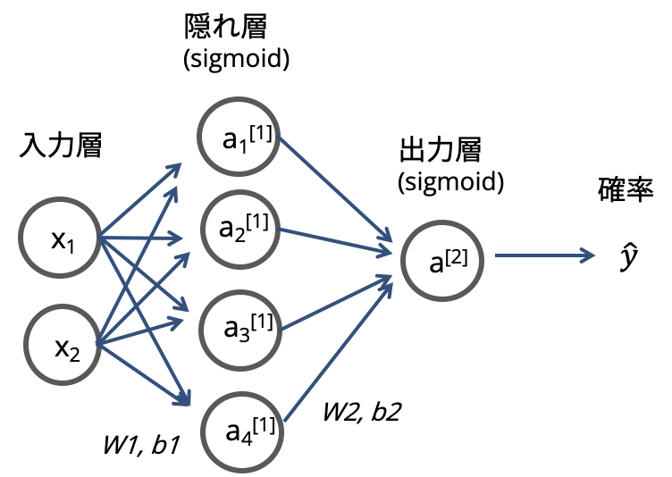
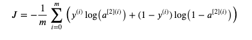
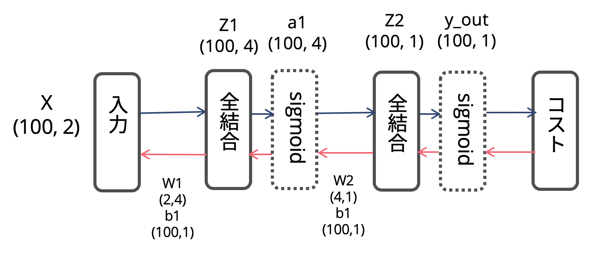

<!-- _class: lead -->

# 50行で作るニューラルネットワーク
## ブログ書いた
https://wimper-1996.hatenablog.com/entry/2020/02/25/031320

---

ブログに載ってないコード(グラフを色ぬりする)
```
# ロジスティック回帰
h = 0.02
x_min, x_max = X[:, 0].min() - 1, X[:, 0].max() + 1
y_min, y_max = X[:, 1].min() - 1, X[:, 1].max() + 1
xx, yy = np.meshgrid(np.arange(x_min, x_max, h),
                     np.arange(y_min, y_max, h))
# Z = clf.predict(np.c_[xx.ravel(), yy.ravel()]) でもいける
Z = clf.predict(np.array([xx.ravel(), yy.ravel()]).T)
print(Z.shape)
Z = Z.reshape(xx.shape)
fig = plt.figure()
plt.contourf(xx, yy, Z, cmap=plt.cm.Spectral, alpha=0.8)
plt.scatter(X[:, 0], X[:, 1], c=y_, s=40, cmap=plt.cm.Spectral)
plt.xlim(xx.min(), xx.max())
plt.ylim(yy.min(), yy.max())
#fig.savefig('spiral_linear.png')

# Print accuracy
y_pred_lr = clf.predict(X)
score = accuracy_score(y_, y_pred_lr)
print ('Accuracy of logistic regression: %d ' % (score * 100) +
       '% ' + "(percentage of correctly labelled datapoints)")
```

---

```
# ニューラルネットワーク
h = 0.02
x_min, x_max = X[:, 0].min() - 1, X[:, 0].max() + 1
y_min, y_max = X[:, 1].min() - 1, X[:, 1].max() + 1
xx, yy = np.meshgrid(np.arange(x_min, x_max, h),
                     np.arange(y_min, y_max, h))
Z = np.array([xx.ravel(), yy.ravel()]).T
Z = np.dot(Z, W1) + b1
Z = np.tanh(Z)
Z = np.dot(Z, W2) + b2
Z = sigmoid(Z)
Z = Z.reshape(xx.shape)
fig = plt.figure()
plt.contourf(xx, yy, Z, cmap=plt.cm.Spectral, alpha=0.8)
plt.scatter(X[:, 0], X[:, 1], c=y_, s=40, cmap=plt.cm.Spectral)
plt.xlim(xx.min(), xx.max())
plt.ylim(yy.min(), yy.max())
#fig.savefig('spiral_net.png')
```
----

# 今回実装するニューラルネットワーク



- 出力層ユニット1の２値分類
- 最も単純な2層からなるニューラルネットワーク
- 入力層ユニット数は2(つまり特徴量２), 隠れ層ユニット数は4

---
<!-- _class: lead -->
# Key Point

- ニューラルネットワークは[ロジスティック回帰]の発展版である
- 順伝播：ただの線型結合 + 非線形変換 + コスト関数の計算
    - 非線形活性化関数をかますことで、深い関数を表現できる
    - 線型結合だけじゃ直線しか表現できない
- 逆伝播：**合成関数の連鎖積**つええ

詳しくはブログ見ながら....

---

# 逆伝播

必要な数学

次の導関数は？
$$
f(x) = \frac{ 1 }{ 1 + e^{-x} }
$$



---

# 重み`W` & バイアス項`b`の初期値の形は？

行列の形(shape)を意識しよう

- データの数(100)は保ちたいよね？？つまりXの行数は入力から出力までずっと**100**
でもユニット数を変化させたい。じゃあWの行列の形は？
- 同様に考えるとbは？

----
# 全体の流れ



---

<!-- _class: lead -->
# Thank you!:blush: